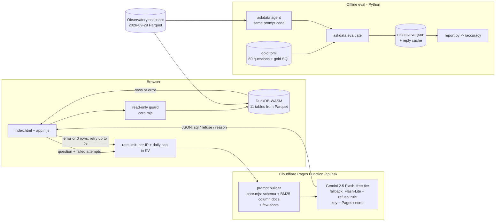

# askdata

**Live:** https://askdata.levelbrook.com · **How accurate is it?** https://askdata.levelbrook.com/accuracy

askdata answers plain-English questions about the remote US data-jobs market by writing SQL against the
[Data Jobs Observatory](https://datajobs.levelbrook.com) warehouse ([repo](https://github.com/tachyurgy/datajobs-observatory)).
The query runs in the browser on DuckDB-WASM, and every step is shown: the generated SQL, any retries, the
result table and a chart.

The point of the project is the measurement. A text-to-SQL demo that answers three hand-picked questions says
nothing about how often it is right. askdata ships with a 60-question gold set, a scorer, ablations that isolate
what each part of the pipeline contributes, confidence intervals, and an error taxonomy, and the live site links
to those numbers.

## The problem

"Ask your data" tools fail quietly. The SQL runs, a number comes back, and it is wrong because the model joined
the wrong table, forgot a filter the data team always applies, or invented a column that happened to exist under
another name. The failure modes worth measuring:

- **Grounding:** does the model use the documented definitions (here, the default market filter
  `is_open AND remote_us AND is_canonical_listing`) or its own?
- **Schema recall:** does it pick the right table among a fact table, a bridge, and seven precomputed marts?
- **Refusal:** does it decline questions the warehouse cannot answer (applicants, equity, company size), or
  does it stand in an unrelated column and return a confident number?
- **Recovery:** when a query errors, can it fix itself from the error message?

## Architecture



- **Prompt (ablation d, what the site runs):** the full schema with table descriptions; the data-dictionary notes
  from the upstream `docs/SCHEMA.md`; the 14 column docs (description + sample values) that best match the
  question by BM25 with a small synonym expansion, capped at two per column name; and the three nearest worked
  examples from a 15-example pool. This is lightweight RAG over the data dictionary, not over documents. The
  Flash-Lite fallback adds an answerability rule (ablation e).
- **One implementation of the prompt, two languages.** `askdata/prompt.py` (used by the eval) and
  `web/public/js/core.mjs` (used by the Pages Function) read the same exported assets. `tests/test_parity.py`
  builds prompts for all 60 gold questions under every ablation in both languages and asserts they are
  byte-identical, so the published accuracy describes the prompt the site actually sends.
- **Read-only guard** (`askdata/guard.py`, mirrored in `core.mjs`, verdicts checked for parity on a 54-statement
  corpus): exactly one statement starting with SELECT or WITH; no DDL/DML/session/extension keywords; no
  file/network/SQL-eval functions (`read_*`, `*_scan`, `glob`, `query`, ...); FROM/JOIN targets must be a known
  table, a CTE, a subquery or a generator; no `FROM 'file.csv'`. Python additionally requires sqlglot to parse it
  as a single query. On top of that the connection has external access disabled and its configuration locked,
  results are capped at 1,000 rows, and queries are interrupted after 10 seconds.
- **Self-correction:** an execution error or an empty result goes back to the model with the failed SQL, up to
  two retries.
- **Web:** static Cloudflare Pages site. DuckDB-WASM loads the 1.1 MB snapshot into memory; the model is only
  called through `/api/ask`, which holds the Gemini key as a Pages secret and enforces a per-IP daily limit, a
  global daily cap and a burst limit. When any limit or the free quota is hit, the page falls back to cached
  example answers, whose SQL still runs live in the browser.

## Eval methodology

**Gold set** (`gold/gold.toml`): 60 questions, 53 answerable and 7 that should be refused, across seven types:
lookup (10), aggregation (11), join (10), window functions (7), date logic (8), ambiguous phrasing (7) and
unanswerable (7). Each answerable question has hand-written gold SQL.

**How the gold set was verified** (`make gold-check`):

1. Every gold query is executed against the snapshot, and its result was read by hand.
2. 38 questions carry an independently written second query that must return the same result through a different
   route (a precomputed mart vs the fact table, a correlated subquery vs a window function, EXISTS vs GROUP BY ...
   HAVING).
3. 29 pin a hand-verified value or row count (for example 969 listings and 441 companies, which match the
   Observatory's published headline), so a data refresh cannot silently move a target.
4. Ranking questions were checked for ties at the cut-off (top 3 companies: 25, 16, 16, then 15).

Step 2 found something real: the warehouse carries **two definitions of "open remote-US listings"**. The
documented default filter gives 969 listings at 441 companies; the counters in `mart_daily_market` and
`dim_company` give 1,016 listing keys and 448 companies, because `is_canonical_listing` picks one posting per
listing across *all* locations, so a remote duplicate of a non-remote canonical posting drops out. Gold follows
the documented filter; for the five questions where the other definition is a defensible reading, it is accepted
and reported separately (the "strict" column excludes it).

**Scoring** (`askdata/compare.py`): result sets are compared as multisets; column names and order are ignored and
extra predicted columns are allowed; row order is enforced only for ranking questions, and ties may come back in
any order; non-integer numbers match within 0.1% or when the prediction is the gold value rounded to its own
decimals, integers match exactly; a fraction and the same value as a percent match; a timestamp matches a gold
date on the same day. Unanswerable questions are correct only when the agent refuses.

**Metrics:** execution accuracy over the 53 answerable questions, refusal accuracy over the 7 unanswerable ones,
overall accuracy over all 60, false refusals, retries used, model latency and tokens. 95% intervals are percentile
bootstraps over questions (2,000 resamples); step-to-step changes use a paired bootstrap.

**Ablations** (cumulative, temperature 0):

| | adds |
|---|---|
| a | zero-shot, full schema (table and column names and types only) |
| b | table descriptions, dictionary notes, top-14 retrieved column docs with sample values |
| c | top-3 retrieved few-shot examples |
| d | self-correction, up to 2 retries on an error or an empty result |
| e | an answerability rule in the system prompt |

d uses the same prompt as c, so the harness reuses c's first reply and only spends calls on retries. e was added
after the first run showed refusal was the weakest skill; the rule was written from the schema and checked on a
separate 16-question dev set (`gold/dev.toml`: 13/16 correct refusal decisions without it, 15/16 with it, one
iteration, no further tuning), not on the gold questions.

**Error taxonomy:** failures are tagged by a rule-based classifier (refusal errors, hallucinated column or table,
other execution error, empty result, missing default filter, wrong table or join, date logic, wrong filter value,
wrong result shape, wrong calculation). It is a heuristic; the accuracy page shows worked examples for each class.

**Models:** all free tier through the Gemini API: Gemini 2.5 Flash-Lite, Gemini 2.5 Flash with thinking off
(the live model), and Gemma 4 31B, an open-weights model. Calls are paced per model with backoff on 429, and every
reply is cached under `results/cache/` by a hash of model and prompt, so `make eval-offline` re-scores the whole
eval with no API calls and CI checks that it reproduces the committed results. Total spend: $0.

## Results

All numbers below are from `results/eval.json` (full table: [`results/RESULTS.md`](results/RESULTS.md); per-question
detail and failure examples: [askdata.levelbrook.com/accuracy](https://askdata.levelbrook.com/accuracy)).
Overall accuracy is over all 60 questions, with 95% bootstrap intervals.

| Model | a: schema only | b: + column docs | c: + few-shot | d: + self-correct | e: + refusal rule | median / p90 latency at d |
|---|---|---|---|---|---|---|
| Gemini 2.5 Flash-Lite | 20% (10-30) | 42% (30-53) | 68% (57-80) | 68% (57-80) | **73% (62-83)** | 0.7s / 0.9s |
| Gemini 2.5 Flash, thinking off | 25% (15-37) | 67% (55-78) | 78% (67-88) | **78% (67-88)** | 70% (58-82) | 0.9s / 2.9s |
| Gemma 4 31B (open weights) | 28% (17-40) | 75% (63-85) | 92% (83-98) | **92% (83-98)** | 87% (77-95) | 14.1s / 48.5s |

What the ablations show:

- **Grounding is the largest lever.** Zero-shot, all three models land at 20-28%, and the single biggest failure
  class is ignoring the documented default market filter (21 of 48 failures for Flash-Lite, 21 of 45 for Flash,
  26 of 43 for Gemma). Adding the dictionary notes and retrieved column docs (a -> b) adds 21.7, 41.7 and 46.7
  points; all three paired intervals exclude zero.
- **Few-shot examples help further**: +26.7 points for Flash-Lite and +16.7 for Gemma (intervals exclude zero),
  +11.7 for Flash (interval reaches zero). Discount this somewhat: several examples are template siblings of gold
  questions.
- **Self-correction added nothing measurable here**: 0.0 points for all three models. It triggered on 5, 2 and 1
  questions. Twice (Flash-Lite, D01 and D04) a retry turned a failing query into one that ran, but both answers were
  still wrong; in the other cases the model, at temperature 0, re-emitted the same failing query. On this gold set
  execution errors are rare once the prompt is grounded, and most remaining failures are queries that run and
  return the wrong thing, which an error-driven loop cannot see. The loop stays in the product because it is
  cheap, not because the eval credits it.
- **The answerability rule is model-specific.** It lifted Flash-Lite's refusal accuracy from 2/7 to 4/7 (+5.0
  points overall, interval 0.0 to +11.7) but cost Flash 8.3 points and Gemma 5.0 points: those models already
  refused 6/7 and 7/7, and the longer system prompt changed SQL on questions they had been getting right. The
  site therefore runs Flash at ablation d, and uses the rule only on its Flash-Lite fallback.
- **Accuracy vs latency.** Gemma 4 31B is the most accurate configuration (92%, 7/7 refusals) but its median
  model time is 14.1s and p90 48.5s on the free tier. The live site runs **Gemini 2.5 Flash at ablation d (78%,
  95% CI 67-88%, 0.9s median)** and falls back to Flash-Lite at ablation e (73%) when Flash's free quota runs out.
- **What is still hard** (Flash, ablation d): window functions 4/7, ambiguous phrasing 4/7, joins 7/10; lookups 10/10.

**Engine parity, found in live testing.** A question that passed the eval failed in the browser: duckdb-wasm 1.32.0
bundles DuckDB 1.4.3, which lacks a `strftime` overload that the Python engine accepted. The site now pins
duckdb-wasm 1.33.1-dev57.0 (DuckDB 1.5.4) and the eval pins the Python package to 1.5.4, so model SQL is scored on
the engine version the browser runs; ICU is loaded explicitly and both sessions run in UTC.

## Limitations

- **Small gold set.** 60 questions, so intervals are wide and one question moves a score by 1.7 points. Several
  step-to-step differences are within noise; the paired intervals above say which.
- **Author-written gold.** The gold SQL, the dictionary notes, the retrieval synonyms, the few-shot pool and the
  answerability rule were all written by the same author. The few-shot examples never answer a gold question
  (tested), but several are template siblings of one (same shape, different entity), which flatters ablation c.
  The answerability rule was written after seeing run-1 failures, even though it was only tuned on the dev set,
  so treat e as optimistic.
- **Single domain and snapshot.** One warehouse, one crawl day, English only. The "ambiguous" questions encode one
  reading (the documented default filter); a reasonable analyst could disagree on some.
- **Execution accuracy is lenient in one direction.** A wrong query that happens to return the right numbers is
  scored correct, and the one-sentence answer the site writes on top of the result is not graded.
- **Scorer changes after run 1.** Inspecting the first run exposed an order-dependent matching bug (a 0.1%
  tolerance let 2021 match 2022) and a false negative (a timestamp answering a which-date question). Both were
  fixed with regression tests and every model was re-scored from the cache; no model reply changed.

## Run it

```bash
make setup           # venv + pinned deps (uv, Python 3.12)
make test            # guard, comparator, agent loop, gold integrity, JS/Python parity (node required)
make gold-check      # execute and cross-check the gold set
make eval-offline    # re-score from the committed reply cache: no API key needed
GEMINI_API_KEY=... make eval MODELS="gemini-2.5-flash-lite"   # new calls only for uncached prompts
make report          # rebuild web/public/accuracy.html and results/RESULTS.md
make deploy          # Cloudflare Pages (needs a Pages token)
```

Ask from the command line:

```bash
PYTHONPATH=. .venv/bin/python -c "
from askdata.db import connect; from askdata.agent import ask
t = ask(connect(), 'Which companies have the most open AI engineer listings?', ablation='e')
print(t.final_sql); print(t.result.rows[:5])"
```

Layout: `askdata/` (agent, guard, comparator, eval, report), `gold/` (gold set, few-shot pool, dev set),
`data/` (snapshot Parquet + dictionary), `results/` (eval JSON, reply cache, RESULTS.md), `web/` (site, Pages
Function, shared assets), `tests/`.

The snapshot is the Observatory's crawl of 2026-09-29. The Observatory itself is rebuilt daily; askdata stays on a
frozen copy so its accuracy numbers stay reproducible.
